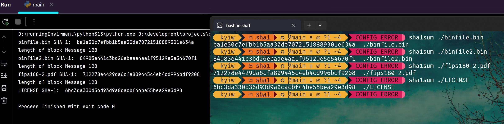

# SHA1 python script

## Author: Kyi Wong

## EMail: kyiwong97@gmail.com

---
## Goal

easy to sum SHA1 string and file.

---
## Usage

`python ./main.py`

---
## Result

---
## License 

This project is licensed under the [MIT license](https://github.com/danielmiessler/SecLists/blob/master/LICENSE).

Any problem? Please leave a message:)
